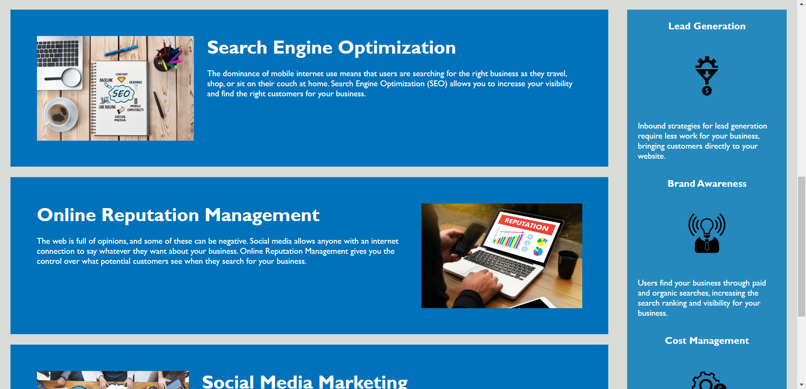
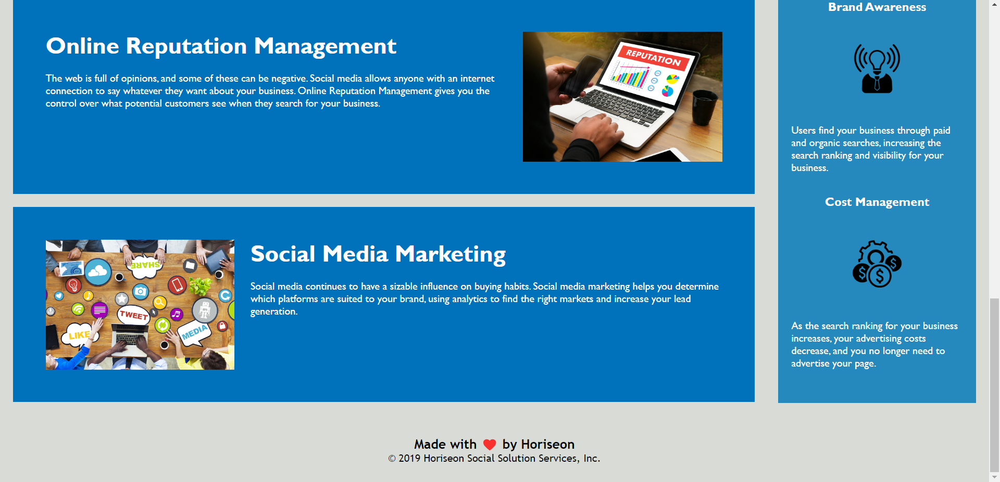

# 01-Blake-Boiteux-Online-Repo
Blake's online repo for class - Module 1 Challenge - change nonsemantic elements into semantic elements.

User Story

AS A marketing agency
I WANT a codebase that follows accessibility standards
SO THAT our own site is optimized for search engines

Acceptance Criteria

GIVEN a webpage meets accessibility standards
WHEN I view the source code
THEN I find semantic HTML elements
WHEN I view the structure of the HTML elements
THEN I find that the elements follow a logical structure independent of styling and positioning
WHEN I view the image elements
THEN I find accessible alt attributes
WHEN I view the heading attributes
THEN they fall in sequential order
WHEN I view the title element
THEN I find a concise, descriptive title

Deployed Application link: file:///C:/Users/blake/bootcamp/Blake-Boiteux-Module-1/blakes-code/index.html

screenshots of the deployed application:

[screenshot 1](image.png)

Sources that were used during this assignment came from class in canvas, as well as through some websites containing semantic code elements:

https://developer.mozilla.org/en-US/docs/Web/HTML/Element/aside
https://www.w3schools.com/html/html5_semantic_elements.asp

The original code (starter code) source for both HTML and CSS was provided through class at: https://github.com/coding-boot-camp/urban-octo-telegram by Xandromus

